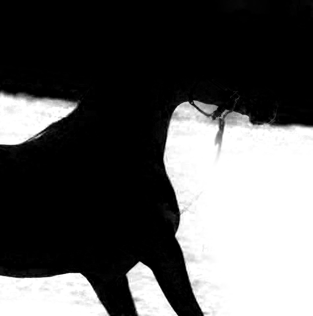

# QuILTER: <u>Qu</u>ick Feathering of <u>I</u>mage Segments with Guided Fi<u>lter</u>

Feather binary masks from semantic segmentation using [He et al.'s guided filter](http://kaiminghe.com/publications/eccv10guidedfilter.pdf) _without affecting their union_ (see [Motivation](#motivation) for more info). The entire process takes a fraction of a second: after loading the image and masks, feathering the example below took 0.186 seconds on average. Applying the guided filter to each segment reveals small details typically missed by semantic segmentation networks, such as individual fingers in hands in the example (segments visualized by projecting to three dimensions with PCA).

|  |  |  |
| :-------------------------------: | :---------------------------------: | :--------------------------------: |
|         `car-kids` image          |          before feathering          |       feathered (0.186 sec)        |

The name "QuILTER" is both a portmanteau of the project's subtitle and an allusion to quills, which are made with feathers.

# Usage

download cod

run

# Examples

All of the segments in the examples are generated by extracting the leaf nodes from the hierarchy generated with [Facebook Research's DETR](https://github.com/facebookresearch/detr), though they could be replaced with one generated by other networks such as those from [MMSegmentation](https://github.com/open-mmlab/mmsegmentation).

For the `baseball` image, passing each segment through the guided filter clarified the selection around the brim of the player's hat and at the intersection of the glove and arm.

|  |  |  |
| :-------------------------------: | :---------------------------------: | :--------------------------------: |
|         `baseball` image          |          before feathering          |       feathered (0.184 sec)        |

The feathering also made the area around the ears in the `horse` image more accurate, and revealed the gap between the horse's body and the part of the bit under its neck.

|  |  |  |
| :-------------------------: | :------------------------------: | :-----------------------------: |
|        `horse` image        |        before feathering         |      feathered (0.144 sec)      |

# Motivation

While they generally classify large regions correctly, many semantic segmentation algorithms struggle to maintain accuracy in small areas packed with lots of detail, such as the rightmost boy's hand in the `car-kids` image. Although not the original intent, [He et al.'s guided filter](http://kaiminghe.com/publications/eccv10guidedfilter.pdf) can be used to feather binary masks to include these small details. However, applying the guided filter to each segment output from semantic segmentation results in masks that don't add together properly: some of the areas are under-covered, and others are over-covered.

For example, below are the naively-filtered masks for the `horse` image. The rightmost image shows pixels where the union of the feathered masks is 255 (black) or not (white). In order for the filtered masks to be useful in all the same applications as the unfiltered masks, their union must sum to exactly 255, so that, when applied to the original image, it recreates exactly the original.

|  |  |  |  |
| :------------------------: | :------------------------: | :------------------------: | :----------------------------: |
|        naive mask 1        |        naive mask 2        |        naive mask 3        |   white where `union != 255`   |

The code handles pixels whose corresponding mask weights sum to a value greater than 255 by scaling down _all_ of that pixel's corresponding mask weights until they sum to exactly 255. Since the resulting values aren't guaranteed to be whole numbers, each of the mask weights is floored when converted into 8-bit unsigned integers. The sum of the weights is now less than or equal to 255. In order to make them all equal, the difference is added to the largest of the mask weights, since that's the likely classification from the original segmentation result.

Somehow adding to the largest value doesn't cause the union to integer overflow for the example images ¯\\\_(ツ)\_/¯
